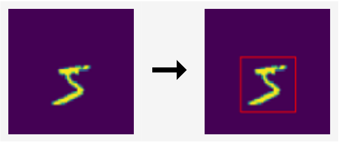

# object-detection-mnist

In these notebooks we will learn how to implement a convolutional neural network (CNN) regressor to localize digits of the MNIST dataset. We will use the PyTorch library for training our model.

1. The input to our model will be a 64 x 64 image with a MNIST digit at any location, and the output of the model are four real numbers that define a bounding box (x, y, width, and height) around the digit. 

2. Then we will modify our model by adding a classification output, so that it can jointly predict the bounding box of the digit and also its class label. 

## References

The above notebooks are adapted versions of an assignment given by 
[Lluis Gomez i Bigorda](http://lluisgomez.github.io/) for my M5:Visual Recognition class
